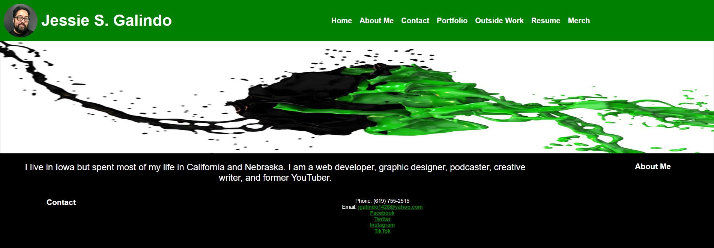
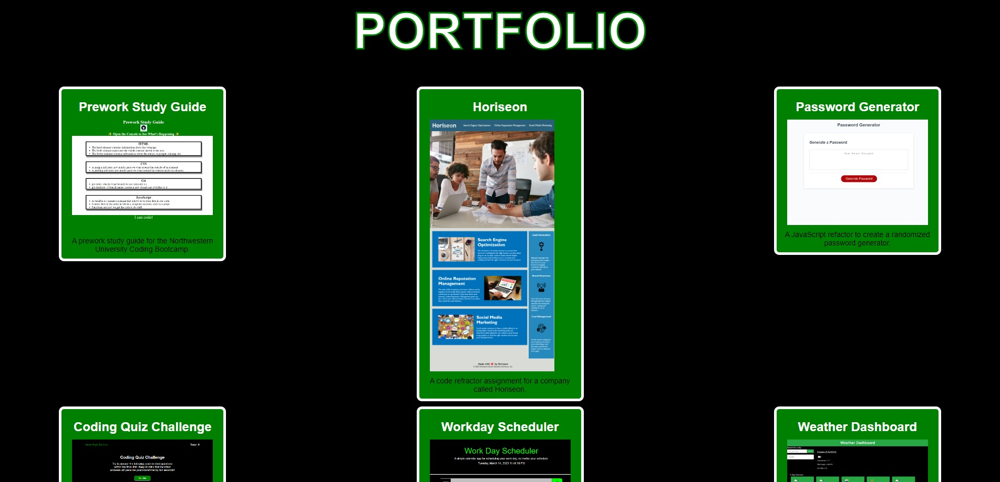

# Jessie Galindo Portfolio

## Description

I created a portfolio of my work. It has a section about me, a contact section, and a section containing a few of my projects that I have created throughout the Northwestern University Full Stack Coding Bootcamp. I added a Navbar that jumps to each section and also has links to other projects I have done outside of coding. There are also links to my resume and my Spreadshirt shop. I used HTML and CSS to create this page.

## Installation

No installation necessary.

## Usage

To use this page, you can click the links in the Navbar to jump to the About Me, Contact, and Portfolio sections under the banner image. There are additional links in the Navbar that take you to other sites that are also affiliated with me.

## Credits

N/A

## License

## Helpful Links

- [Repository](https://github.com/MrMessyFace/jessie-galindo-portfolio)
- [Live App](https://mrmessyface.github.io/jessie-galindo-portfolio/)

&copy; 2023 Jessie S. Galindo. All Rights Reserved.
